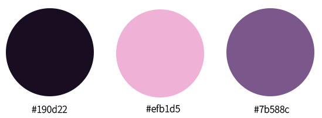

# MoonChoice Portfolio
문정해의 포트폴리오입니다.

## 📢 About
📆 제작 기간 : 2024.06 ~ 2024.07  
👤 제작 인원 : 1명

## ⚙️ Tools
- html
- sass
- javascript

## 🌕 Concept
'문정해'에서 '문'은 영어로 Moon, 즉 '달'을 의미합니다.  
이름의 상징적인 의미를 고려하여 포트폴리오 홈페이지의 디자인 컨셉을 **달**로 설정했습니다.  
이를 바탕으로 특별하고 의미 있는 홈페이지를 제작하였습니다.

## 🌙 Logo
별명 moonchoice(문초이스)를 활용하여 제작하였습니다. 
 

## 🎨 Color

## 💡 기능 설명
1. HOME

2. ABOUT ME
- 해당 섹션에 도달하면 보이지 않던 텍스트가 타이핑 효과와 함께 나타나도록 하였습니다.
- 타이핑 효과가 끝난 후, 나머지 텍스트가 애니메이션과 함께 보이도록 설정하였습니다.

3. SKILL
- 그래프가 0에서 시작해 각 아이콘에 해당하는 퍼센티지까지 올라갑니다.
- [pc] 아이콘을 원형으로 배치하여 회전하게 하였으며, 아이콘에 마우스를 올리면 회전이 멈추고 관련된 내용이 표시되도록 하였습니다.
- [모바일] 아이콘을 카테고리별로 정리하여, 해당 카테고리 버튼을 누르면 관련된 아이콘만 보도록 하였습니다.
- [모바일] 아이콘을 클릭하면 해당 아이콘의 내용이 모달 창으로 나타나도록 하였습니다.

4. PORTFOLIO
- 첫 화면에는 섹션 타이틀만 보이게 하였고, 해당 섹션에 도달하면 타이틀이 애니메이션 효과와 함께 나타나도록 하였습니다.
- 포트폴리오 설명 텍스트는 해당 영역에 도달하면 사이드에서 들어오도록 설정하였고, 이미지는 자동으로 위아래로 움직이게 설정하였습니다.
- 이미지에 마우스를 올리면 움직임이 멈추도록 설정하였습니다.

## ☠️ 어려웠던 점
 
## 🌈 소감
